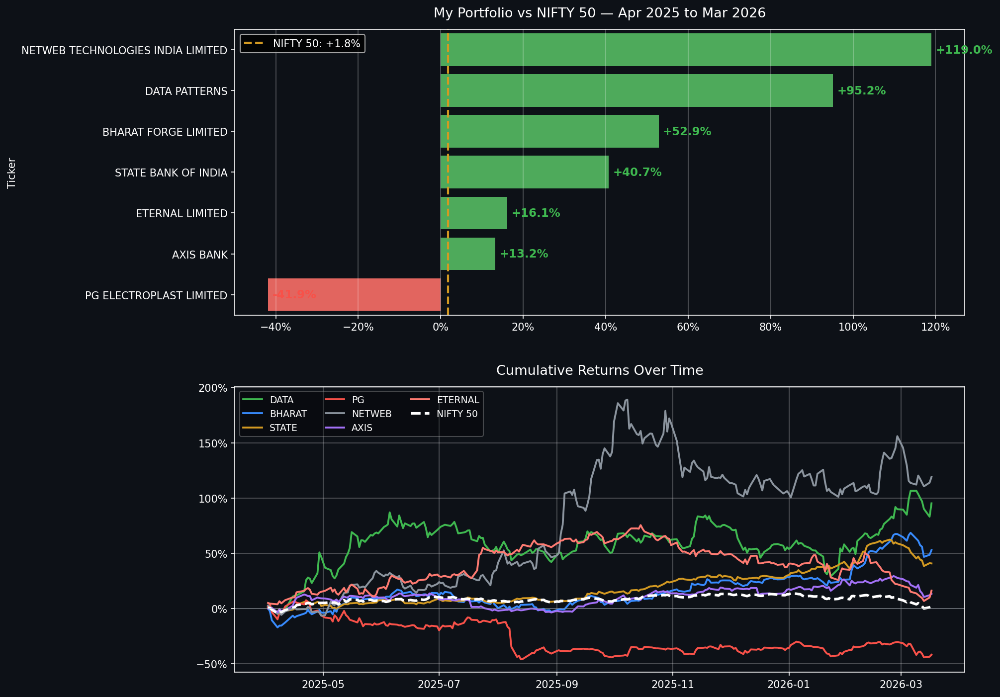

# Nifty Portfolio Analysis
### By Ankith K | Data Analyst | BFSI Domain Expert

## What this project does
Analyses 7 NSE stocks vs NIFTY 50 benchmark
for FY 2025-26 using real market data.

## Results
- Netweb Technologies : +119%
- Data Patterns       : +95.2%
- Bharat Forge        : +52.9%
- SBI                 : +40.7%
- Eternal (Zomato)    : +16.1%
- Axis Bank           : +13.2%
- PG Electroplast     : -41.9%
- NIFTY 50 Benchmark  : +1.8%

## Tools Used
Python | Pandas | Seaborn | yfinance | Matplotlib

## Chart

