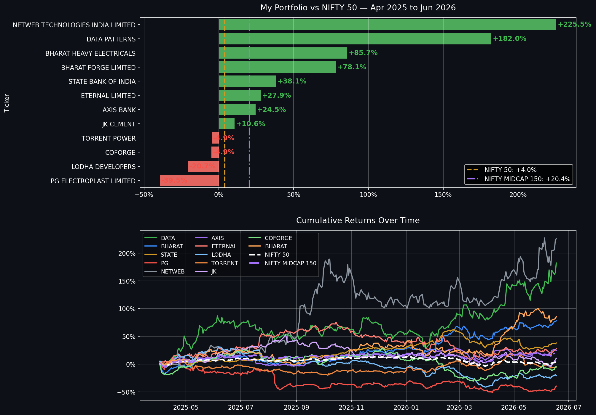

# Nifty Portfolio Analysis

### By Ankith K | Data Analyst | BFSI Domain

Analyses **12 NSE stocks** vs NIFTY 50 and NIFTY MIDCAP 150 benchmarks
for the period **Apr 2025 – Jun 2026**, using real market data from Yahoo Finance.

---

## How to Run

```bash
pip install yfinance pandas matplotlib seaborn
python Nifty_Portfolio_Analysis.py
```

This will generate `my_portfolio_chart.png` — a 2-panel chart showing who won/lost and the journey over time.

---

## Results (Apr 2025 → Jun 2026)

| Stock | Total Return |
|---|---|
| 🟢 NETWEB TECHNOLOGIES | +225.5% |
| 🟢 DATA PATTERNS | +182.0% |
| 🟢 BHARAT HEAVY ELECTRICALS | +85.7% |
| 🟢 BHARAT FORGE | +78.2% |
| 🟢 STATE BANK OF INDIA | +38.1% |
| 🟢 ETERNAL LIMITED | +27.9% |
| 🟢 AXIS BANK | +24.5% |
| 🟢 JK CEMENT | +10.6% |
| 🔴 TORRENT POWER | -4.9% |
| 🔴 COFORGE | -4.9% |
| 🔴 LODHA DEVELOPERS | -20.7% |
| 🔴 PG ELECTROPLAST | -39.5% |
| ⚪ **My Portfolio (equal weight)** | **+41.7%** |
| ⚪ NIFTY 50 Benchmark | +4.0% |
| ⚪ NIFTY MIDCAP 150 Benchmark | +20.4% |

**Portfolio beat NIFTY 50 by +37.7% and NIFTY MIDCAP 150 by +21.3%**

---

## Tools Used

`Python` | `Pandas` | `Seaborn` | `yfinance` | `Matplotlib`

---

## Chart


